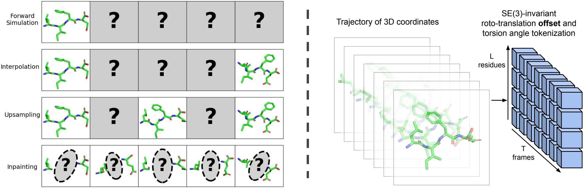

# MDGen

This repository extends the original [MDGen (Generative Modeling of Molecular Dynamics Trajectories)](https://arxiv.org/abs/2409.17808) by Bowen Jing*, Hannes Stark*, Tommi Jaakkola, and Bonnie Berger from tetrapeptides (4AA) to **octapeptides (8AA)**. This fork is maintained by yiyang.lu@stu.ecnu.edu.cn.

The original MDGen introduces generative modeling of molecular trajectories as a paradigm for learning flexible multi-task surrogate models of MD from data. By conditioning on appropriately chosen frames of the trajectory, such generative models can be adapted to diverse tasks such as forward simulation, transition path sampling, and trajectory upsampling. This fork builds upon that work by extending the framework to longer octapeptide systems, validating the generative modeling approach on larger and more complex molecular dynamics trajectories. For questions about the original work, please reach out to bjing@mit.edu or hstark@mit.edu.

**Note:** This repository is provided for research reproducibility and is not intended for usage in application workflows.



## Installation

We recommend using conda to manage the environment, which avoids common system library conflicts (see [Troubleshooting](#troubleshooting)):

```bash
conda create -n mdgen python=3.9 -y
conda activate mdgen

# Install libstdc++ from conda-forge to avoid GLIBCXX version errors
conda install -c conda-forge libstdcxx-ng -y

pip install numpy==1.21.2 pandas==1.5.3
pip install torch==1.12.1+cu113 -f https://download.pytorch.org/whl/torch_stable.html
pip install pytorch_lightning==2.0.4 mdtraj==1.9.9 biopython==1.79
pip install wandb dm-tree einops torchdiffeq fair-esm pyEMMA
pip install matplotlib==3.7.2 numpy==1.21.2
```

**Important**: Before running any training or inference script, ensure the environment is set up:
```bash
conda activate mdgen
export LD_LIBRARY_PATH="${CONDA_PREFIX}/lib:${LD_LIBRARY_PATH}"
```

> The training shell scripts (`scripts/run_8AA_*.sh`) set `LD_LIBRARY_PATH` automatically. For standalone Python commands (e.g., inference), you must set it manually or add it to `~/.bashrc`.

## Datasets

1. Download the tetrapeptide MD datasets:
```
mkdir -p data/4AA_sims data/4AA_sims_implicit
gsutil -m rsync -r gs://mdgen-public/4AA_sims data/4AA_sims
gsutil -m rsync -r gs://mdgen-public/4AA_sims_implicit data/4AA_sims_implicit
```
**Update: we are temporarily unable to publicly host the MD dataset. Please contact us for access.**


2. Download the ATLAS simulations via https://github.com/bjing2016/alphaflow/blob/master/scripts/download_atlas.sh to `data/atlas_sims`.
3. Preprocess the tetrapeptide simulations
```
# Forward simulation and TPS, prep with interval 100 * 100fs = 10ps
python -m scripts.prep_sims --splits splits/4AA.csv --sim_dir data/4AA_sims --outdir data/4AA_data --num_workers [N] --suffix _i100 --stride 100

# Upsampling, prep with interval 100fs
python -m scripts.prep_sims --splits splits/4AA_implicit.csv --sim_dir data/4AA_sims_implicit --outdir data/4AA_data_implicit --num_workers [N]

# Inpainting, prep with interval 100fs 
python -m scripts.prep_sims --splits splits/4AA.csv --sim_dir data/4AA_sims --outdir data/4AA_data --num_workers [N]
```
4. Preprocess the ATLAS simulations
```
# Prep with interval 40 * 10 ps = 400 ps
python -m scripts.prep_sims --splits splits/atlas.csv --sim_dir data/atlas_sims --outdir data/atlas_data --num_workers [N] --suffix _i40 --stride 40
```

## Training

Commands similar to these were used to train the models presented in the paper.
```
# Forward simulation
python train.py --sim_condition --train_split splits/4AA_train.csv --val_split splits/4AA_val.csv --data_dir data/4AA_data/ --num_frames 1000 --prepend_ipa --abs_pos_emb --crop 4 --ckpt_freq 40 --val_repeat 25 --suffix _i100 --epochs 10000 --wandb --run_name [NAME]

# Interpolation / TPS
python train.py --tps_condition --train_split splits/4AA_train.csv --val_split splits/4AA_val.csv --data_dir data/4AA_data/ --num_frames 100 --prepend_ipa --abs_pos_emb --crop 4 --ckpt_freq 40 --val_repeat 25 --suffix _i100 --epochs 10000 --wandb --run_name [NAME]

# Upsampling
python train.py --sim_condition --train_split splits/4AA_implicit_train.csv --val_split splits/4AA_implicit_val.csv --data_dir data/4AA_data_implicit/ --num_frames 1000 --prepend_ipa --abs_pos_emb --crop 4 --ckpt_freq 20 --val_repeat 25 --cond_interval 100 --batch_size 8 --epochs 10000 --wandb --run_name [NAME]

# Inpainting / design
python train.py --inpainting --train_split splits/4AA_train.csv --val_split splits/4AA_val.csv --data_dir data/4AA_data --num_frames 100 --prepend_ipa --abs_pos_emb --crop 4 --ckpt_freq 100 --val_repeat 25 --batch_size 32 --design --sampling_method euler --epochs 10000 --frame_interval 10 --no_aa_emb --no_torsion --wandb --run_name [NAME]

# ATLAS
python train.py --sim_condition --train_split splits/atlas_train.csv --val_split splits/atlas_val.csv --data_dir share/data_atlas/ --num_frames 250 --batch_size 1 --prepend_ipa --crop 256 --val_repeat 25 --epochs 10000 --atlas --ckpt_freq 10 --suffix _i40 --wandb --run_name [NAME]
```

## Model weights

The model weights used in the paper may be downloaded here:
```
wget https://storage.googleapis.com/mdgen-public/weights/forward_sim.ckpt
wget https://storage.googleapis.com/mdgen-public/weights/interpolation.ckpt
wget https://storage.googleapis.com/mdgen-public/weights/upsampling.ckpt
wget https://storage.googleapis.com/mdgen-public/weights/inpainting.ckpt
wget https://storage.googleapis.com/mdgen-public/weights/atlas.ckpt
```

## Inference

Commands similar to these were used to obtain the samples analyzed in the paper.
```
# Forward simulation
python sim_inference.py --sim_ckpt forward_sim.ckpt --data_dir share/4AA_sims --split splits/4AA_test.csv --num_rollouts 10 --num_frames 1000 --xtc --out_dir [DIR]

# Interpolation / TPS
python tps_inference.py --sim_ckpt interpolation.ckpt --data_dir share/4AA_sims --split splits/4AA_test.csv --num_frames 100 --suffix _i100 --mddir data/4AA_sims  --out_dir /data/cb/scratch/share/results/0506_tps_1ns 

# Upsampling 
python upsampling_inference.py --ckpt upsampling.ckpt --split splits/4AA_implicit_test.csv --out_dir outpdb/0505_100ps_upsampling_3139 --batch_size 10 --xtc --out_dir [DIR]

# Inpainting / design for high flux transitions
python design_inference.py --sim_ckpt inpainting.ckpt --split splits/4AA_test.csv --data_dir data/4AA_data/ --num_frames 100 --mddir data/4AA_sims --random_start_idx --out_dir [DIR] 

# Inpainting / design for random transitions
python design_inference.py --sim_ckpt inpainting.ckpt --split splits/4AA_test.csv --data_dir data/4AA_data/ --num_frames 100 --mddir data/4AA_sims --out_dir [DIR] 

# ATLAS forward simulation # note no --xtc here!
python sim_inference.py --sim_ckpt atlas.ckpt --data_dir share/data_atlas/ --num_frames 250 --num_rollouts 1 --split splits/atlas_test.csv --suffix _R1 --out_dir [DIR]
```

## Analysis

We run analysis scripts that produce a pickle file in each sample directory.
```
# Forward simulation
python -m scripts.analyze_peptide_sim --mddir data/4AA_sims --pdbdir [DIR] --plot --save --num_workers 1

# Interpolation / TPS
python -m scripts.analyze_peptide_tps --mddir data/4AA_sims --data_dir data/4AA_sims  --pdbdir [DIR] --plot --save --num_workers 1 --outdir [DIR]

# Upsampling
python -m scripts.analyze_upsampling --mddir data/4AA_sims_implicit --pdbdir [DIR] --plot --save --num_workers 1

# Inpainting / design
python -m scripts.analyze_peptide_design --mddir data/4AA_sims --data_dir data/4AA_data --pdbdir [DIR]
```
To analyze the ATLAS rollouts, follow the instructions at https://github.com/bjing2016/alphaflow?tab=readme-ov-file#Evaluation-scripts.

Tables and figures in the paper are extracted from these pickle files.

## Octapeptides (8AA) Support

This repository has been extended to support Octapeptides (8-residue peptides) in addition to the original tetrapeptide (4AA) and ATLAS workflows.

### Data Preparation

Each octapeptide is capped with **ACE** (N-terminal) and **NME** (C-terminal) groups to neutralize terminal charges during MD simulation. This results in 10 residues per trajectory (ACE + 8 standard AA + NME). The preprocessing pipeline automatically strips these capping groups and extracts only the 8 standard amino acid residues for model training.

The preprocessing pipeline expects **hydrogen-free** trajectories. Before running `prep_sims.py`, generate `{name}_noH.xtc` and `{name}_noH.pdb` from your raw simulation data:

```python
import mdtraj, os

sim_dir = '/localhome3/lyy/octapeptides_data'
for name in sorted(os.listdir(sim_dir)):
    d = os.path.join(sim_dir, name)
    if not os.path.isdir(d) or not name.startswith('opep_'):
        continue
    traj = mdtraj.load(os.path.join(d, 'prod.xtc'), top=os.path.join(d, 'prmtop'))
    heavy = traj.top.select('not element H')
    traj_noH = traj.atom_slice(heavy)
    traj_noH.save(os.path.join(d, f'{name}_noH.xtc'))
    traj_noH[0].save(os.path.join(d, f'{name}_noH.pdb'))
    print(f'{name}: {traj.n_atoms} -> {traj_noH.n_atoms} atoms, {traj_noH.n_frames} frames')
```

### Data Directory Convention

After preparation, each peptide directory should contain:
```
octapeptides_data/
  opep_0000/opep_0000_noH.pdb, opep_0000_noH.xtc
  opep_0001/opep_0001_noH.pdb, opep_0001_noH.xtc
  ...
  opep_1099/opep_1099_noH.pdb, opep_1099_noH.xtc
```

### Workflow

**0. Verify raw data** (check all 1100 peptides are complete):
```bash
python -m scripts.check_raw_data --data_dir /localhome3/lyy/octapeptides_data
```

**1. Generate split CSVs** (80/10/10 train/val/test → 880/110/110):
```bash
SIM_DIR=/localhome3/lyy/octapeptides_data

python -m scripts.generate_8AA_splits --data_dir $SIM_DIR --outdir splits
```

**2. Preprocess** — choose stride based on your data version:
```bash
SIM_DIR=/localhome3/lyy/octapeptides_data

# 10ns data (1M frames, frame interval 10fs, stride=100 → 10,000 frames at Δt=1ps)
python -m scripts.prep_sims --split splits/8AA.csv --sim_dir $SIM_DIR --outdir data/8AA_data --num_workers 8 --suffix _i100 --stride 100 --octapeptides

# 100ns production data (1M frames, frame interval 100fs, stride=100 → 10,000 frames at Δt=10ps)
# python -m scripts.prep_sims --split splits/8AA.csv --sim_dir $SIM_DIR --outdir data/8AA_data --num_workers 8 --suffix _i100 --stride 100 --octapeptides
```

**2b. Verify preprocessed data**:
```bash
python -m scripts.verify_data --data_dir data/8AA_data --suffix _i100
```

> **Note**: 10ns data uses Δt=1ps per frame; 100ns data uses Δt=10ps (matching 4AA). Models trained on 10ns data should be retrained when switching to 100ns.

**3. Train** — two-phase approach for stable convergence:
```bash
# Phase 1: 2000 epochs (initial training)
bash scripts/run_8AA_phase1.sh          # single GPU
bash scripts/run_8AA_phase1.sh --multi  # multi-GPU (GPUs 1-7)

# Check loss convergence
python plot_loss.py workdir/8AA_sim_phase1/log.out --save

# Phase 2: 10000 epochs (resume from Phase 1 checkpoint)
bash scripts/run_8AA_phase2.sh          # single GPU
bash scripts/run_8AA_phase2.sh --multi  # multi-GPU (GPUs 1-7)
```

> **Note**: Phase 2 automatically finds the last Phase 1 checkpoint. To use a specific checkpoint: `CKPT=path/to/epoch=XXX.ckpt bash scripts/run_8AA_phase2.sh`

**4. Inference** (forward simulation, match suffix to training data):
```bash
# Test run (1,000 frames: 100 × 10 rollouts)
python sim_inference.py --sim_ckpt workdir/8AA_sim_phase2/best.ckpt --data_dir data/8AA_data --split splits/8AA_test.csv --num_frames 100 --num_rollouts 10 --suffix _i100 --xtc --out_dir results/8AA_test_1k

# Full run (10,000 frames: 1,000 × 10 rollouts)
python sim_inference.py --sim_ckpt workdir/8AA_sim_phase2/best.ckpt --data_dir data/8AA_data --split splits/8AA_test.csv --num_frames 1000 --num_rollouts 10 --suffix _i100 --xtc --out_dir results/8AA_full_10k
```

| Config | `--num_frames` | `--num_rollouts` | Total frames | Notes |
|--------|---------------|-----------------|-------------|-------|
| Test   | 100           | 10              | 1,000       | Quick validation |
| Full   | 1,000         | 10              | 10,000      | Full evaluation |

**5. Analysis**:
```bash
python scripts/analyze_8AA_sim.py \
    --pdbdir results/8AA_full_10k \
    --mddir /localhome3/lyy/octapeptides_data \
    --split splits/8AA_test.csv \
    --save --plot \
    --num_workers 16
```

**6. Reading results**:

The analysis script produces three types of output:

**(a) Terminal summary** — printed at the end of the run:
- Per-feature JSD table (Mean / Std / N for each torsion angle)
- Overall torsion JSD (excluding TICA)
- TICA-0 and TICA-0,1 JSD
- MSM metastable state probability MAE

**(b) Pickle file** — `{pdbdir}/out_8AA.pkl`, a dict keyed by peptide name:
```python
import pickle, numpy as np

with open('results/8AA_full_10k/out_8AA.pkl', 'rb') as f:
    out = pickle.load(f)

# out['opep_XXXX'] contains:
#   ['JSD']                    — dict of feature_name → JSD value
#                                includes torsion angles, Ramachandran pairs,
#                                TICA-0, and TICA-0,1
#   ['md_decorrelation']       — dict of feature_name → autocorrelation array (MD ref)
#   ['our_decorrelation']      — dict of feature_name → autocorrelation array (generated)
#   ['ref_metastable_probs']   — 10-state MSM distribution (MD ref)
#   ['traj_metastable_probs']  — 10-state MSM distribution (generated)
#   ['msm_pi']                 — MSM stationary distribution (MD ref)
#   ['traj_pi']                — MSM stationary distribution (generated)
#   ['msm_transition_matrix']  — 10×10 transition matrix (MD ref)
#   ['traj_transition_matrix'] — 10×10 transition matrix (generated)
#   ['features']               — list of feature names

# Quick aggregate statistics:
all_torsion_jsd = []
for name, r in out.items():
    if 'error' in r:
        continue
    for feat, jsd in r['JSD'].items():
        if 'TICA' not in feat and '|' not in feat:
            all_torsion_jsd.append(jsd)
print(f'Torsion JSD: {np.nanmean(all_torsion_jsd):.4f} ± {np.nanstd(all_torsion_jsd):.4f}')
```

**(c) Per-peptide PDF plots** — `{pdbdir}/{name}_analysis.pdf`, containing:
- Torsion angle histograms (blue = MD reference, orange = generated)
- Decorrelation curves for backbone and sidechain torsions
- TICA free energy surface comparison (MD vs generated)
- TICA autocorrelation curves

**Key metrics** (lower is better):

| Metric | Meaning |
|--------|---------|
| Torsion JSD | Torsion angle distribution match |
| TICA-0,1 JSD | Slow dynamics (free energy surface) match |
| MSM prob MAE | Metastable state population error |

### Data & Diagnostics

- `scripts/check_raw_data.py` — Verify all 1100 raw peptide directories are complete
- `scripts/verify_data.py` — Validate preprocessed .npy file shapes, dtypes, and values
- `scripts/diagnose_data.py` — Comprehensive diagnostics (NaN, inf, degenerate geometry)
- `scripts/filter_bad_npy.py` — Remove corrupted entries from split CSVs

### Limitations

- Design/inpainting: indices are auto-derived from `--crop` (terminals=conditioned, interior=designed) but have **not been validated** on 8AA data.
- Multi-chain, membrane proteins, and ligand conditioning are not supported.

## Troubleshooting

### 1. `GLIBCXX_3.4.29 not found`

```
ImportError: /lib64/libstdc++.so.6: version `GLIBCXX_3.4.29' not found
```

**Cause**: The system `libstdc++.so.6` is too old (e.g., CentOS 7 / GCC < 11), but pip-installed packages (pandas, etc.) were compiled against newer versions.

**Fix**:
```bash
# Install newer libstdc++ into the conda environment
conda install -c conda-forge libstdcxx-ng -y

# Set LD_LIBRARY_PATH so conda's library is found first
export LD_LIBRARY_PATH="${CONDA_PREFIX}/lib:${LD_LIBRARY_PATH}"
```

> All `scripts/run_8AA_*.sh` scripts set this automatically. For standalone commands (inference, analysis), set it manually or add to `~/.bashrc`.

**Verify**:
```bash
strings "${CONDA_PREFIX}/lib/libstdc++.so.6" | grep GLIBCXX | tail -5
# Should show GLIBCXX_3.4.29 or higher
```

### 2. Silent NaN in training loss

**Symptom**: Training runs without errors but loss becomes NaN after some epochs.

**Cause**: Numerical instability in bf16-mixed precision with large models, or corrupted input data.

**Fix**:
1. Monitor loss regularly: `python plot_loss.py workdir/<run_name>/log.out --save`
2. Validate data before training: `python -m scripts.diagnose_data --data_dir data/8AA_data --suffix _i100`
3. Filter out corrupted entries: `python -m scripts.filter_bad_npy --data_dir data/8AA_data --suffix _i100 --splits splits/8AA_train.csv splits/8AA_val.csv splits/8AA_test.csv`

### 3. OOM (Out of Memory) with 1000-frame training

**Symptom**: `CUDA out of memory` when using `--num_frames 1000`.

**Cause**: 1000-frame sequences consume ~10x more GPU memory than 100-frame sequences.

**Fix**: Reduce batch size and scale learning rate accordingly:
- `--batch_size 2` (down from 16)
- `--lr 5e-5` (sqrt-scaled: `2e-4 * sqrt(2*7 / 16*7) ≈ 5e-5`)
- See `scripts/run_8AA_1000frames.sh` for the full config

### 4. `PYTHONPATH` conflicts with system modules

**Symptom**: Import errors mentioning system-installed packages under `/apps/` or similar paths.

**Fix**: The training scripts automatically filter these:
```bash
export PYTHONPATH=$(echo "$PYTHONPATH" | tr ':' '\n' | grep -v '/apps/' | tr '\n' ':' | sed 's/:$//')
```

For standalone commands, either run this export or unset PYTHONPATH entirely:
```bash
unset PYTHONPATH  # if you only need conda packages
```

### 5. `MPI4PY` initialization errors

**Symptom**: MPI-related crashes or warnings when using PyTorch Lightning DDP.

**Fix**:
```bash
export MPI4PY_RC_INITIALIZE=0
```

### 6. numpy version mismatch / collation errors

**Symptom**: `ValueError` during data loading or shape mismatch in collation.

**Cause**: numpy >= 1.24 changed how structured arrays and type promotion work.

**Fix**: Pin numpy to the version specified in the installation:
```bash
pip install numpy==1.21.2
```

### 7. ACE/NME capping groups not stripped

**Symptom**: Preprocessed data has shape `(T, 10, 14, 3)` instead of `(T, 8, 14, 3)`.

**Cause**: Raw octapeptide trajectories include ACE (N-terminal) and NME (C-terminal) capping residues.

**Fix**: Ensure `--octapeptides` flag is passed to `prep_sims.py` — it automatically strips ACE/NME:
```bash
python -m scripts.prep_sims --split splits/8AA.csv --sim_dir $SIM_DIR --outdir data/8AA_data \
    --num_workers 8 --suffix _i100 --stride 100 --octapeptides
```

Verify shapes after preprocessing:
```bash
python -m scripts.verify_data --data_dir data/8AA_data --suffix _i100
# Expected: (T, 8, 14, 3), dtype=float16
```

### 8. Hydrogen atoms in trajectory

**Symptom**: Atom count mismatch or unexpected atom14 mapping errors.

**Cause**: The model expects hydrogen-free trajectories. Raw MD outputs include hydrogens.

**Fix**: Generate `{name}_noH.xtc` and `{name}_noH.pdb` before preprocessing (see [Data Preparation](#data-preparation) section).

## License

MIT. Additional licenses may apply for third-party source code noted in file headers.

## Citation
```
@misc{jing2024generativemodelingmoleculardynamics,
      title={Generative Modeling of Molecular Dynamics Trajectories}, 
      author={Bowen Jing and Hannes Stärk and Tommi Jaakkola and Bonnie Berger},
      year={2024},
      eprint={2409.17808},
      archivePrefix={arXiv},
      primaryClass={q-bio.BM},
      url={https://arxiv.org/abs/2409.17808}, 
}
```
